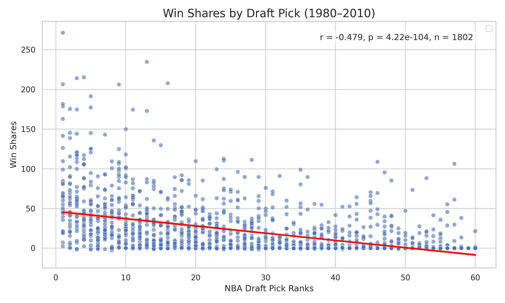
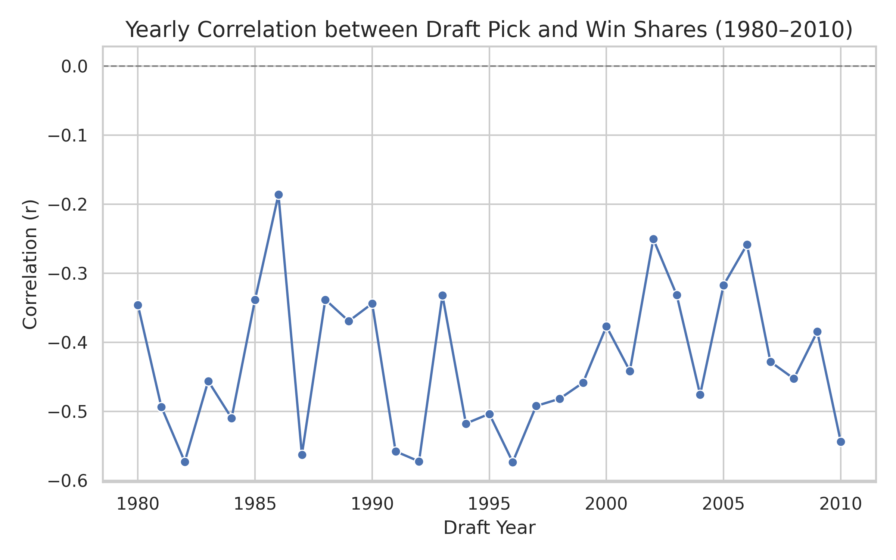

# Statistical Insights into Draft Efficiency in the NBA
### "Do Top Draft Picks in NBA actually perform well?"

## Data  
In this project, we used a basketball reference website(`https://www.basketball-reference.com/draft/`). The NBA draft records spans from 1980 to 2010 and serves as the foundation for evaluating draft efficiency and player performance.   
Since only the top 60 draft picks per year are considered meaningful, our analysis focuses exclusively on the performance of players selected within ranks 1 to 60 for each draft year. Even players with performance metrics of zero were included to ensure a realistic and comprehensive evaluation.

### Data Collection Method
 This dataset was compiled by scraping NBA draft records from 1980 to 2010, with each year's data extracted from a dedicated webpage. 

### Limitation of Data
The data compiled suffered from some notable limitations.
  Firstly, the size of the draft picks varied year by year. In 1980, for example, the draft pick contained 214 selections and 10 rounds, while 1988 included only 75 selections and 3 rounds. By 1989, the number of selections and rounds standardized at 54 selections and 2 rounds, however the number of selections changed every few years. By 2010, 60 selections were made with only 2 rounds. This meant that the sample size was not standard throughout our timeframe, and meant that without editing, our data could suffer from homoskedastic errors. To correct this, we limited our data collection to the top 60 selections per year, however that meant that any analysis on players ranked below 60 could not be performed. 
    Of note, some limitations regarding this were self enforced, as we chose to cover a select range of years rather than the entirety of the available data. Thus, years before 1980 and after 2010 were not covered in our analysis.
  Secondly, the quality of the data also varied heavily depending on the year. Player data below the top 20 ranked players was inconsistent, with missing values becoming more frequent the lower the rank was. While NA values were thoroughly removed from our data, this meant that analysis on players with missing data values could not be performed. 
  Thirdly, the data did not cover important team metrics that can have significant effects on performance. Metrics such as team philosophies, individual player injuries, era differences, or the changing of a player's role on the team were not included, all of which can easily be determining factors into whether a player is ranked highly. 
  Finally, because the data used already consisted of calculations such as total points, shooting success chances, VORP, etc., it is entirely possible that additional features regarding player performance may have been lost, simply due to how the raw data was collected. While statistics such as VORP, BPM, and WS may help with insight onto a player's performance, the reliance on averages and calculations done on individual games without being able to access said individual game statistics means that some insight is lost, especially in regards to whether individual games had a significant effect on the draft rank of a player. In theory, access to these individual statistics could remedy this issue, however the compilation of such statistics would likely be difficult in practice. 

### Extension of Data
Further research could be done regarding (but not limited to) the following areas:
    News coverage: Whether the news coverage around a player had a greater effect on ranking compared to their actual overall performance/win contribution.
    Player roles: Whether certain roles a player could take on the team were more desirable depending on the year.
    NBA Eras: Whether the prioritized skills of a player varied heavily depending on the era the NBA was in. 
    Steroid usage: Whether players that were caught using performance enhancing substances such as steroids more likely to achieve a higher ranking.
Furthermore, increasing the size of the player pool could be beneficial for continued research on this topic. 

### Glossary
The key metrics used to evaluate draft efficiency are as follows:  

Pk: Draft rank    
WS: Win Shares (An estimate of the number of wins contributed by a player)  
PTS: Points per game  
Years: Seasons the player has appeared in the NBA  
MP: Minutes played per game

For detailed explanations of the key terms used to assess draft efficiency, please refer to `reference/nba_stat_glossary.csv`.

### Descriptive Summary

## Draft Efficiency Analysis  

### Win shares and draft rank
If you make a scatter plot between win shares and draft ranks from 1980 to 2010 (number of observations: 1,802), there is a clear negative correlation (-0.4796). The results indicate that players selected at higher draft ranks (lower numerical values) tend to accumulate more career wins, suggesting a meaningful correlation between draft order and performance.
  
 
  
You can get these results (`analysis/results/ws_pick.png`, `analysis/results/ws_pick.txt`) by rerunning (`analysis/ws_pick.py`).

The negative correlation between draft rank and win share has fluctuated consistently from 1980 to 2010. While the year-by-year correlation graph does not reveal any notable long-term trends, this may suggest that the draft market has operated efficiently over time.  

 

The strongest negative correlation was observed in 1996, with a correlation coefficient of -0.619 and p-value of 0.000. This indicates that players with higher draft rankings (i.e., lower pick numbers) contributed significantly to team wins that year, and the result is statistically significant. The 1st pick in 1996 was Allen Iverson, followed by Kobe Bryant in 13th pick. Historically, the 1996 draft is considered as one of the successful drafts full of talents in NBA history. 

In contrast, the weakest negative correlation occured in 1986, with a coefficient of -0.265 and p-value of 0.040. This suggests that in 1986, the players that teams invested heavily in failed to deliver strong performances, and at the 1% significance level, there was no statistically meaningful evidence that higher draft picks performed better.

You can get these results (`analysis/results/ws_pick_corr_trend.png`, `ws_pick_corr_by_year.csv`, `ws_pick_regression_1986_1996.txt`, `ws_pick_1996_with_stats.png`, `ws_pick_1986_with_stats.png`) by rerunning (`analysis/ws_pick_yearly.py`, `anlysis/ws_pick_plot_1986_1996.py`).

### (Please add other topics)

## Instruction to Rerun

### Analysis code
Your code will be executed in a Python environment contatining the Standard Library and the packages specified in `requirements.txt`. Install them with `pip install -r requirements.txt`.

### Scrape code
Running the scrape code(`data_scraping/draftpick_scrape.py`) will take about 35 minutes. We have already uploaded the original data(`artifacts/nba_draft_1980_2010.csv`) to the repo.
After scraping, we cleaned the data through `data_scraping/draft_data_clean.py`, which gave 'artifacts/nba_draft_1980_2010_cleaned.csv'.

and grouped the data by draft rank(`data_scraping/draft_data_clean_group.py`).

