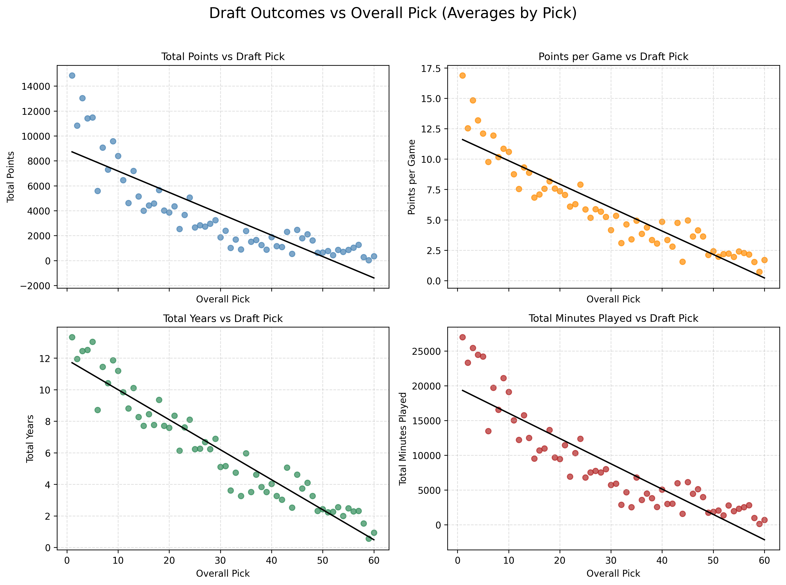
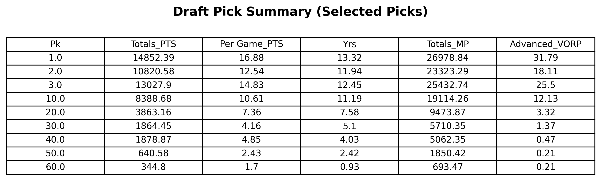
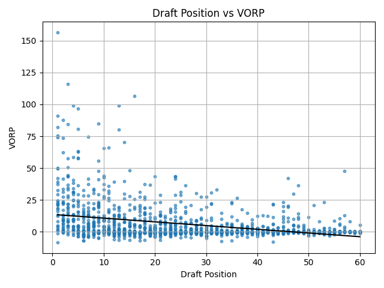

# Statistical Insights into Draft Efficiency in the NBA
### "Do Top Draft Picks in NBA actually perform well?"

## Data  
In this project, we used a basketball reference website(`https://www.basketball-reference.com/draft/`). The NBA draft records spans from 1980 to 2010 and serves as the foundation for evaluating draft efficiency and player performance.   
Since only the top 60 draft picks per year are considered meaningful, our analysis focuses exclusively on the performance of players selected within ranks 1 to 60 for each draft year. Even players with performance metrics of zero were included to ensure a realistic and comprehensive evaluation.

### Data Collection Method
 This dataset was compiled by scraping NBA draft records from 1980 to 2010, with each year's data extracted from a dedicated webpage. 

### Limitation of Data
The data compiled suffered from some notable limitations:  
1. The size of the draft picks varied year by year. In 1980, for example, the draft pick contained 214 selections and 10 rounds, while 1988 included only 75 selections and 3 rounds. By 1989, the number of selections and rounds standardized at 54 selections and 2 rounds, however the number of selections changed every few years. By 2010, 60 selections were made with only 2 rounds. This meant that the sample size was not standard throughout our timeframe, and meant that without editing, our data could not be consistently analyzed. To correct this, we limited our data collection to the top 60 selections per year, however that meant that any analysis on players ranked below 60 could not be performed.  
2. We chose to cover a select range of years rather than the entirety of the available data. Thus, years before 1980 and after 2010 were not covered in our analysis.  
3. The data did not cover important team metrics that can have significant effects on performance. Metrics such as team philosophies, individual player injuries, era differences, or the changing of a player's role on the team were not included, all of which can easily be determining factors into whether a player is ranked highly.   
4. Our analysis relied on pre-aggregated player statistics such as total points, shooting percentages, Win Shares (WS), Box Plus/Minus (BPM), and Value Over Replacement Player (VORP). While these metrics provide useful summaries of overall performance, they obscure important game-level variations that could reveal how consistency, peak performances, or situational factors influence career outcomes and draft success. Access to individual game statistics could enable a more detailed understanding of how performance fluctuations or standout games contribute to long-term player value—but compiling such granular data across decades remains highly challenging.  

### Potential Extension of Data
1. Expand timeframe to include more recent drafts, capturing modern trends.  
2. Include later or undrafted players to study hidden success stories and improve draft efficiency analysis.  
3. Add team and context variables (e.g., coaching, injuries, team fit) for more complete performance evaluation.  
4. Obtaine game-level data to analyze consistency and the impact of standout performances over time.  
5. Combine pre-draft stats (college or international) with career outcomes to strengthen predictive insights.  

### Glossary
The key metrics used to evaluate draft efficiency are as follows:  
- Pk: Draft rank  
- WS: Win Shares 
- PTS: Points per game  
- Years: Seasons the player has appeared in the NBA  
- MP: Minutes played per game 
- VORP: Value Over Replacement Player   

For other key metrics, please refer to `reference/nba_stat_glossary.csv`.

## Methodology for Analysis
1. Data Cleaning: All 30 years of NBA Draft data (1980–2010) were merged into a single unified DataFrame. To ensure consistency, we limited the dataset to the first 60 picks from each draft year—representing two standard rounds. The cleaning process included removing duplicate or corrupted rows, fixing header inconsistencies, and standardizing column names. An additional variable, year, was added to distinguish picks across different years and all numeric fields were verified for validity.  
2. Data Visualization and Tables: We visualized both basic and advanced performance metrics to examine how player outcomes varied by draft position. Scatterplots with fitted trend lines were generated for total points, points per game, total minutes, and career length. Complementary summary tables highlighted grouped averages for key advanced metrics such as Win Shares, Box Plus/Minus, and Value Over Replacement Player (VORP).  
3. Trend Analysis by Pick Ranges: To capture overall patterns rather than individual variability, we grouped draft picks into broader ranges (1–10, 11–20, 21–30, etc.) and compared average career outcomes within each range. This allowed us to evaluate how performance and longevity decline with draft order and to identify where the most substantial drop-offs in player success occur.  

## Descriptive Analysis, Visualization, and Findings  
### Part 1: Draft Pick Summary
We first analyzed how a player’s draft position predicts their career performance by computing pick averages across all 60 draft picks (1980–2010).  
Each pick’s average was calculated for key performance metrics including total points, points per game, total minutes played, years played, and advanced metrics such as Value Over Replacement Player (VORP).  
The plots below show a clear downward trend across all career metrics as draft number increases (i.e., later picks perform worse on average). Top picks (1–5) significantly outperform lower picks across all categories.  

 

To further illustrate differences across specific draft slots, we displayed some key metrics for selected picks in the table below.  

 

The table shows a strong decline in career outcomes as draft position increases. Top picks (1–3) accumulate far more total points, minutes, and years played compared to later selections. On average, players drafted in the top three score more than twice as many total points as those selected around the 20th pick. Interestingly, the 3rd overall pick outperforms the 2nd across nearly every category, an unintuitive but notable trend that suggests variability in individual outcomes even among elite draft positions. Beyond the 30th pick, both career length and productivity drop sharply, with most players contributing minimally at the NBA level.

### Part 2: Win shares and draft rank

Win Shares (WS) measures how much a player contributed to his team’s total wins. It divides a team’s total victories among its players based on their performance. So, if a player has 10 WS, it means he was responsible for about 10 of his team’s wins.  
  
If you make a scatter plot between win shares and draft ranks from 1980 to 2010 (number of observations: 1,802), there is a clear negative correlation (-0.4796). The results indicate that players selected at higher draft ranks (lower numerical values) tend to accumulate more career wins, suggesting a meaningful correlation between draft order and performance.
  
 
  
The negative correlation between draft rank and win share has fluctuated consistently from 1980 to 2010. While the year-by-year correlation graph does not reveal any notable long-term trends, this may suggest that the draft market has operated efficiently over time.  

Next, we examine the year-by-year relationship between draft rank and win shares using a time-series analysis. While the negative correlation between draft rank and win shares has fluctuated consistently from 1980 to 2010, the yearly correlation graph does not reveal any significant long-term trends (trendline slope: 0.001, p-value: 0.549). Ths may suggest that the draft market has operated relatively efficient over time. For further details, you can refer to the yearly correlation data in `analysis/results/ws_pick_corr_by_year.csv`.

 

The strongest negative correlation was observed in 1996, with a correlation coefficient of -0.619 and p-value of 0.000. This indicates that players with higher draft rankings (i.e., lower pick numbers) contributed significantly to team wins that year, and the result is statistically significant. The 1st pick in 1996 was Allen Iverson, followed by Kobe Bryant in 13th pick. Historically, the 1996 draft is considered as one of the successful drafts full of talents in NBA history. 

In contrast, the weakest negative correlation occured in 1986, with a coefficient of -0.265 and p-value of 0.040. This suggests that in 1986, the players that teams invested heavily in failed to deliver strong performances, and at the 1% significance level, there was no statistically meaningful evidence that higher draft picks performed better.

If you are interested in exploring further, feel free to check out the scatter plots and regression results for the years 1996 and 1986. You can refer to the "Instruction to rerun" at the bottom or the results files in the "analysis/results" folder. (e.g. `analysis/results/ws_pick_1996_with_stats.png`)

### Part 3: VORP and draft rank

VORP (Value Over Replacement Player) shows how much better a player is compared to an average “replacement-level” player. In other words, it measures how much value a player adds to his team beyond what a typical backup or bench player would contribute. A higher VORP means the player is more valuable and harder to replace. 

## Summary and Conclusion  
Our analysis reveals a clear and consistent negative relationship between draft position and career performance. Players selected earlier in the draft tend to achieve higher totals in points, minutes, and career longevity, as well as stronger advanced metrics such as Win Shares (WS) and Value Over Replacement Player (VORP). The most significant drop in performance occurs within the first round, where production and longevity decline sharply from early-lottery to late-first-round picks.  
Beyond the 30th pick, player outcomes continue to fall, though the differences between later selections become smaller. Overall, the results confirm that while early picks generally deliver higher value and longer careers, exceptional players can still emerge from any part of the draft, reflecting both the unpredictability and opportunity inherent in the selection process.

Key takeaway: While higher draft selections offer greater average returns, identifying undervalued talent in later rounds remains a crucial edge for successful team building.

## Limitations and Extensions of Analysis
### Limitation of Our Analysis  
- Our analysis focused primarily on descriptive statistics and visual trends, rather than formal hypothesis testing or predictive modeling.  
- By using averages by pick, we may have obscured individual variability—outliers or exceptional players at later picks are not fully captured.  
- The fitted trend lines assumed simple linear relationships, which may not accurately reflect complex or nonlinear dynamics in player performance.    
- We did not differentiate by position, era, or team role, all of which can meaningfully affect player outcomes and draft value.  
- The analysis treated all draft years equally, without accounting for changing league conditions or competition levels over time.  

### Possible Extension of Analysis  
Further research could be done regarding (but not limited to) the following areas:  
- News Coverage: Whether the news coverage around a player had a greater effect on ranking   compared to their actual overall performance/win contribution.  
- Position Differences: Analyze separate trends by position (guards vs forwards vs centers).
- Player Roles: Whether certain roles a player could take on the team were more desirable depending on the year.    
- Era Differences: Whether the prioritized skills of a player varied heavily depending on the era the NBA was in.   

## Instruction to Rerun

### Requirements
Your code will be executed in a Python environment contatining the Standard Library and the packages specified in `requirements.txt`. Install them with `pip install -r requirements.txt`.

### Data Scraping and Cleaning
Running the scrape code(`data_scraping/draftpick_scrape.py`) will take about 35 minutes. We have already uploaded the original data(`artifacts/nba_draft_1980_2010.csv`) to the repo.
After scraping, we cleaned the data through `data_scraping/draft_data_clean.py`, which gave 'artifacts/nba_draft_1980_2010_cleaned.csv'.

### Analysis 
[Part 1: Draft Pick Summary]  

The following code file groups the data by draft rank(`data_scraping/draft_data_clean_group.py`).

Running (`analysis/averages_by_pick.py`) will generate an additional CSV file, (`artifacts/pick_group_averages.csv`), containing the average values of all key performance metrics for each draft pick. Following the creation of this auxilliary csv, one can then run (`analysis/pick_average_trends.py`) and (`analysis/comparison_for_representative_picks.py`) to generate the following analysis results:(`analysis/results/draft_pick_trends.png`), and (`analysis/comparison_for_representative_picks.py`).

[Part 2: Win shares and draft rank]  

To get a scatter plot and regression results (`analysis/results/ws_pick.png`, `analysis/results/ws_pick.txt`), rerun `analysis/ws_pick.py`.  
To get a yearly correlation trend plot and regression results (`analysis/results/ws_pick_corr_trend.png`, `ws_pick_corr_by_year.csv`), rerun (`analysis/ws_pick_yearly.py`).  
If you are intested in scatter plots and regression results in the extreme years in terms of correlation between Win shares and draft rank (`analysis/results/ws_pick_1996_with_stats.png`, `ws_pick_1986_with_stats.png`, `ws_pick_regression_1986_1996.txt`), rerun `anlysis/ws_pick_plot_1986_1996.py`.
